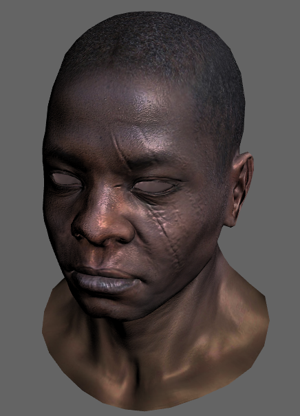

这是一个使用typescript编写的3D光栅化渲染器，核心渲染代码不超过1000行, 核心部分不会使用任何已有的图形引擎和任何硬件相关的接口。

大家可以使用这份代码进行图形学基础的学习, 也可以利用它自己写一些图形效果做一些调试。

目前支持的核心功能有

  * 三角形光栅化
  * 透视贴图
  * 视锥裁剪
  * 边缘剔除
  * 深度缓冲
  * 纹理双线性插值
  * 2x2的MSAA
  * 可灵活定制顶点着色/片元着色, 提供接口和vary插值列表
  
例子中支持的非核心功能:

  * obj模型显示/png纹理读取
  * 基本光照(blinn-phong)
  * 通过鼠标缩放，旋转摄像机

后继计划：
  
  * 支持切线空间的法线纹理

这个是一些渲染截图：

##### 一. 运行

 使用浏览器打开out/demo.html

##### 二. 修改ts代码后如何编译

执行build即可

不过需要配置好编译环境（tsc+webpack)

执行

npm install --only-dev 

即可

##### 三. 常见问题

1. 为什么使用typescript, 而不是常用的c++?

typescript更容易上手, 毕竟是学习用途, 不是为了真正商用, 不需要太多考虑性能上的问题。

2. 为什么不直接渲染出图片, 而是嵌入到网页上做实时渲染？ 

放到网页上做实时渲染确实更费事(需要把framebuffer当做贴图通过webgl的方式渲染到canvas上), 但是实时渲染可以方便做一些简单的人机交互（比如旋转摄像机）

